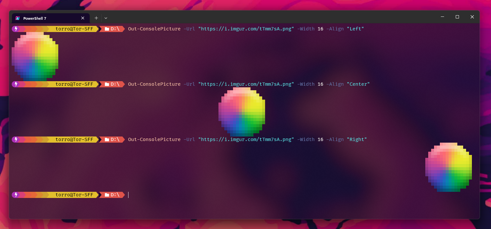
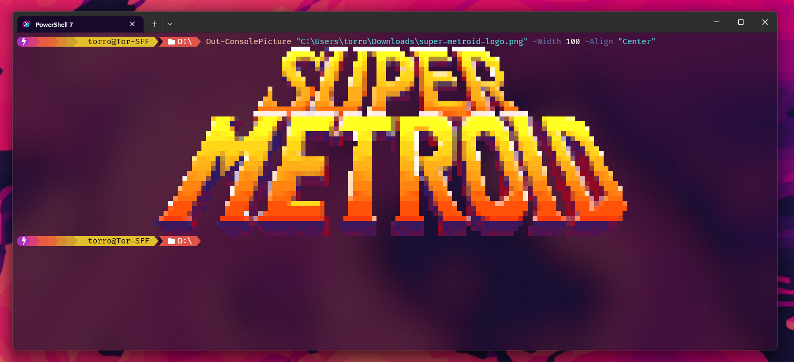
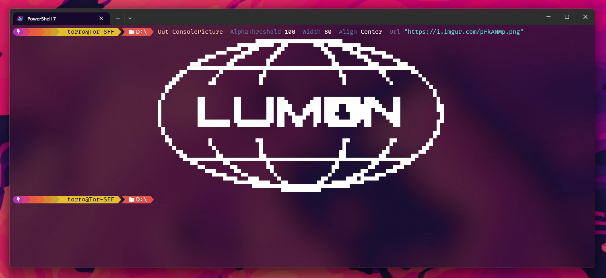

# OutConsolePicture
This is a PowerShell cmdlet for rendering images to console.
It does this by fetching either local or remote image, breaking it down into pairs of top/bottom pixels, and rendering those pairs as ASCII block characters.

# Examples
## Large images		


## Alignment

## Local image from path


## Remote image from URL

# Documentation

From the module definition file:

```
NAME
    Out-ConsolePicture

SYNOPSIS
    Renders an image to the console


SYNTAX
    Out-ConsolePicture [-Path] <String[]> [-Width <Int32>] [-DoNotResize] [-AlphaThreshold <Int32>] [-Align <String>] [<CommonParameters>]

    Out-ConsolePicture -Url <Uri[]> [-Width <Int32>] [-DoNotResize] [-AlphaThreshold <Int32>] [-Align <String>] [<CommonParameters>]

    Out-ConsolePicture -InputObject <Bitmap[]> [-Width <Int32>] [-DoNotResize] [-AlphaThreshold <Int32>] [-Align <String>] [<CommonParameters>]


DESCRIPTION
    Out-ConsolePicture will take an image file and convert it to a text string. Colors will be "encoded" using ANSI escape strings. The final result will be
    output in the shell. By default images will be reformatted to the size of the current shell, though this behaviour can be suppressed with the -DoNotResize
    switch. ISE users, take note: ISE does not report a window width, and scaling fails as a result. I don't think there is anything I can do about that, so
    either use the -DoNotResize switch, or don't use ISE.


PARAMETERS
    -Path <String[]>
        One or more paths to the image(s) to be rendered to the console.

        Required?                    true
        Position?                    1
        Default value
        Accept pipeline input?       false
        Accept wildcard characters?  false

    -Url <Uri[]>
        One or more Urls for the image(s) to be rendered to the console.

        Required?                    true
        Position?                    named
        Default value
        Accept pipeline input?       false
        Accept wildcard characters?  false

    -InputObject <Bitmap[]>
        A Bitmap object that will be rendered to the console.

        Required?                    true
        Position?                    named
        Default value
        Accept pipeline input?       true (ByValue)
        Accept wildcard characters?  false

    -Width <Int32>
        Renders the image at this specific width. Use of the width parameter overrides DoNotResize.

        Required?                    false
        Position?                    named
        Default value                0
        Accept pipeline input?       false
        Accept wildcard characters?  false

    -DoNotResize [<SwitchParameter>]
        By default, images will be resized to have their width match the current console width. Setting this switch disables that behaviour.

        Required?                    false
        Position?                    named
        Default value                False
        Accept pipeline input?       false
        Accept wildcard characters?  false

    -AlphaThreshold <Int32>
        Default 255; Pixels with an alpha (opacity) value less than this are rendered as fully transparent. Fully opaque = 255. Lowering the value will
        require a pixel to be more transparent to vanish, and will therefor include more pixels.

        Required?                    false
        Position?                    named
        Default value                255
        Accept pipeline input?       false
        Accept wildcard characters?  false

    -Align <String>
        Default 'Left'; Align image to the Left, Right, or Center of the terminal. Must be used in conjuction with the Width parameter.

        Required?                    false
        Position?                    named
        Default value                Left
        Accept pipeline input?       false
        Accept wildcard characters?  false

    <CommonParameters>
        This cmdlet supports the common parameters: Verbose, Debug,
        ErrorAction, ErrorVariable, WarningAction, WarningVariable,
        OutBuffer, PipelineVariable, and OutVariable. For more information, see
        about_CommonParameters (https://go.microsoft.com/fwlink/?LinkID=113216).

INPUTS
    One or more System.Drawing.Bitmap objects


OUTPUTS
    Gloriously coloured console output


    -------------------------- EXAMPLE 1 --------------------------

    PS > Out-ConsolePicture ".\someimage.jpg"
    Renders the image to console


    -------------------------- EXAMPLE 2 --------------------------

    PS > Out-ConsolePicture -Url "http://somewhere.com/image.jpg"
    Renders the image to console


    -------------------------- EXAMPLE 3 --------------------------

    PS > $image = New-Object System.Drawing.Bitmap -ArgumentList "C:\myimages\image.png"
    $image | Out-ConsolePicture
    Creates a new Bitmap object from a file on disk renders it to the console

```
# Attribution
 This was initially based off of [NotNotWrongUsually/OutConsolePicture](https://github.com/NotNotWrongUsually/OutConsolePicture) but was splintered, after years of inactivity, to include things like transparency, alignment support, and any improvements going forward!

